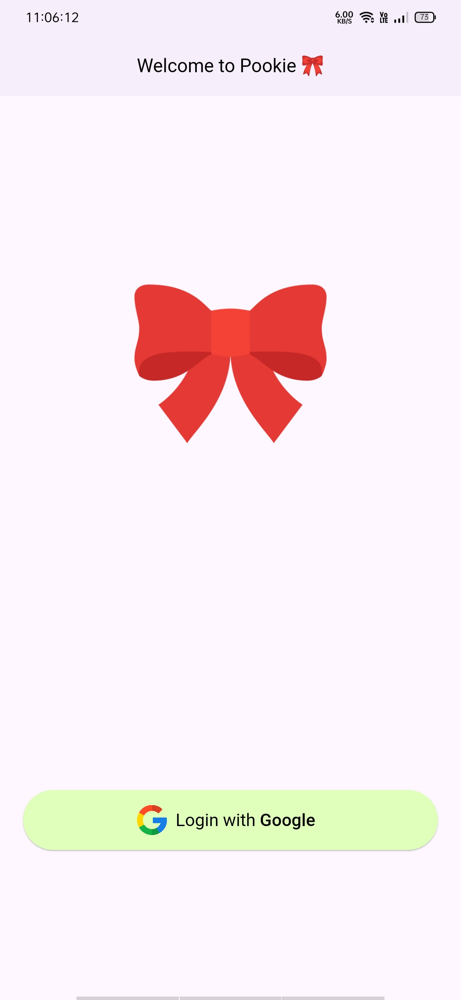
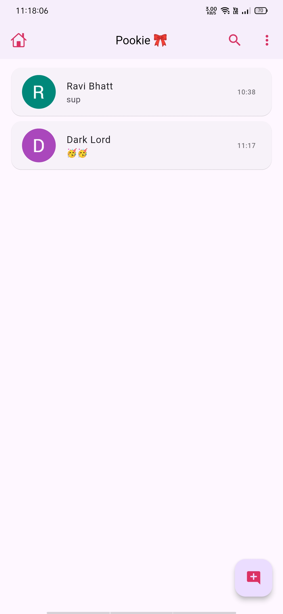
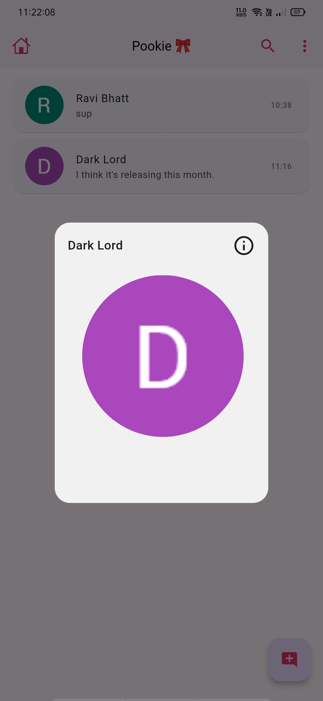
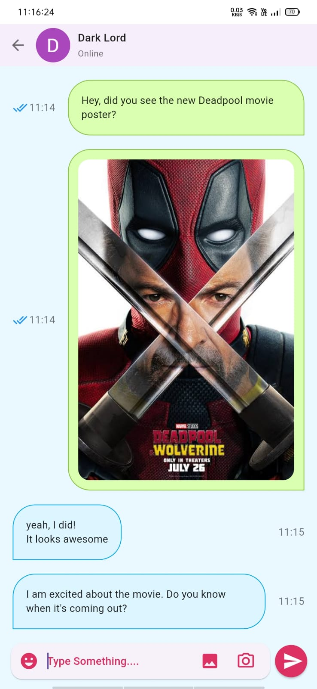
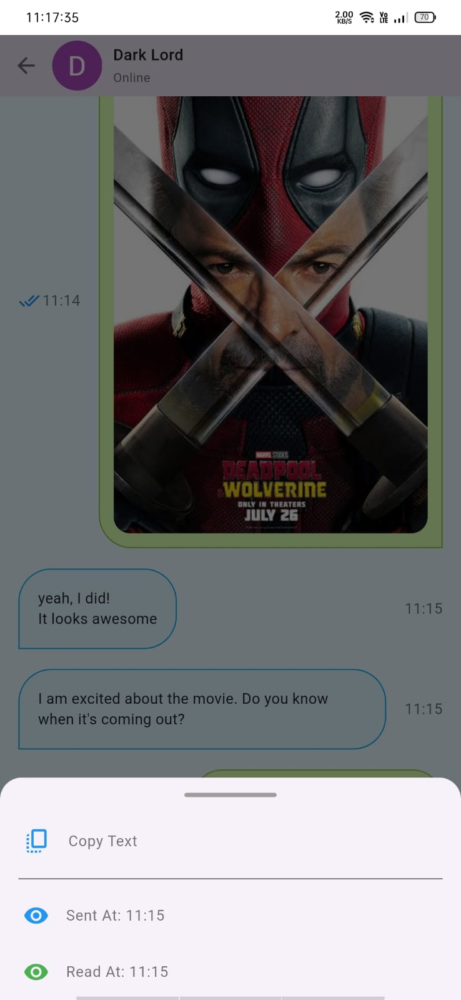
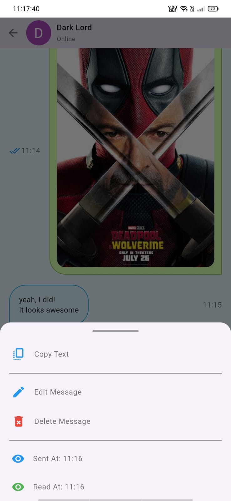
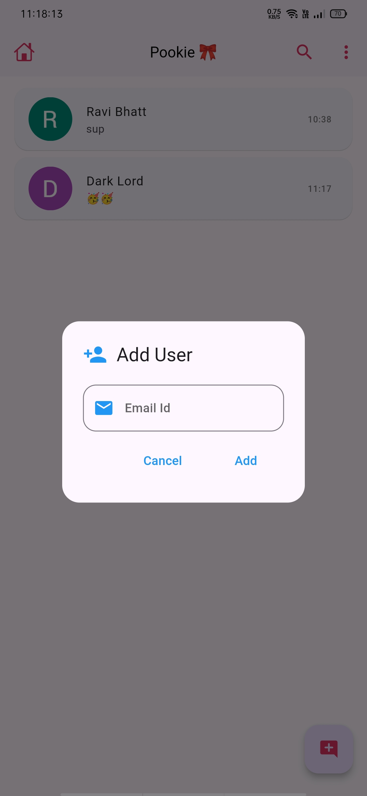
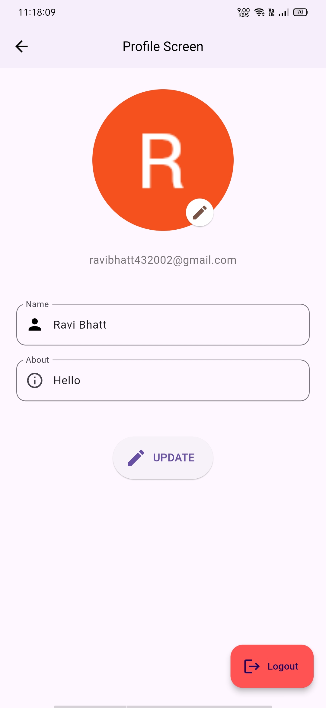

# pookie

A simple chatting app using Flutter and Firebase with following features :-

* Show only known users or contacts
* Real-Time Messaging (With Firebase)
* Google Sign-In (No account or mobile number needed)
* Adding Users using Email Id
* Simple User Profile (with Photo, About, Last-seen, Created-at)
* Message Read Status
* Message Delete & Edit Feature

Screenshots

